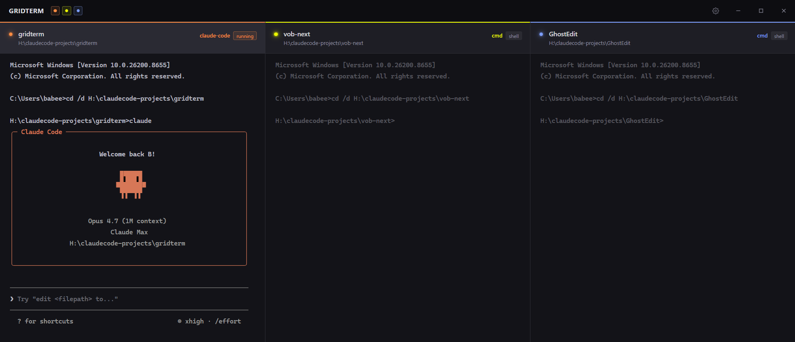

# gridterm

**gridterm is a lightweight terminal grid for Windows.** It puts up to 3 real shells side by side in one window, each with a labeled header showing project name, working directory, and a color-coded dot — so you always know which terminal is which.



## Why

Juggling identical black `cmd` windows is a pain. They all say "Command Prompt" in the taskbar and it's easy to run the wrong command in the wrong project. gridterm gives every terminal an identity: a colored dot, a project name, and a live cwd. You always know where you are before you hit Enter.

## Features

- **1–4 columns** — toggle each one on/off from the top bar
- **Live cwd tracking** — the title updates to the current folder's basename as you `cd`
- **Editable paths** — click the cwd under any title and type a new folder; the terminal actually `cd`s there
- **Claude Code detection** — badge flips to `running` when `claude` is running in that shell
- **Auto-register on `claude`** — the first time `claude` runs in a column, its folder becomes that column's identity and sticks across sessions
- **Persistent slots** — each column's project name + cwd survive restarts (stored in localStorage)
- **Drag to reorder** — grab any header, drop it on another column
- **Image paste** — paste a screenshot into a terminal and it lands as a temp `.png` path, ready for Claude Code to read
- **Settings panel** — click the gear in the top bar to open a bottom sheet with font and color controls (see below)

## Settings

Click the ⚙️ icon in the top bar (right side, before the window controls) to slide up the Settings panel. Everything applies live so you can see changes as you make them.

### Fonts
- **Font** — Cascadia Code, JetBrains Mono, Consolas, Menlo, SF Mono, Courier New, Ubuntu Mono, Fira Code (monospace fonts only — proportional fonts break terminal column alignment)
- **Font size** — 8 to 32, with `−` / `+` steppers
- **Font weight** — Light, Regular, Medium, Semibold, Bold

### Colors
Each terminal has three colors, editable via swatch or hex text field (copy-pasteable between rows):
- **Accent** — the top border stripe and header dot
- **Background color** — the terminal body background
- **Text color** — the default xterm foreground

The vertical **chain link** buttons between color columns sync that color type across all three terminals — click once to link (all three snap to Terminal 1's value), click again to unlink. Individual edits then apply to every linked terminal at once.

The **↺ Reset defaults** icon in the header restores fonts and every color to gridterm's built-in defaults. The **✓ Save settings** icon dismisses the panel (settings are always persisted live to localStorage).

## Install (Windows)

1. Go to [Releases](https://github.com/spiritform/gridterm/releases)
2. Download the latest `gridterm_<version>_x64-setup.exe`
3. Run the installer. Windows may show a SmartScreen warning about an unknown publisher — click **More info → Run anyway**
4. Launch gridterm from the Start menu

## Usage

- **Set a column's project folder** — click the path shown under the title, type the folder you want, press Enter. gridterm runs `cd /d <path>` in that shell and the title updates to the folder's name
- **Register a project by running `claude`** — the moment you start Claude Code in a column, gridterm captures that folder as the column's identity, so future `cd`s inside subfolders won't rename the column
- **Toggle a column off** — kills the shell. Toggling back on reopens it at the last saved folder
- **Restart the app** — every column comes back where you left it

## Build from source

### Prerequisites

- [Node.js](https://nodejs.org/) 20+
- [Rust](https://rustup.rs/)
- Platform SDK:
  - **Windows** — [Visual Studio C++ Build Tools](https://visualstudio.microsoft.com/visual-cpp-build-tools/) + [WebView2](https://developer.microsoft.com/en-us/microsoft-edge/webview2/) (usually preinstalled on Windows 11)
  - **macOS** — Xcode Command Line Tools (`xcode-select --install`)
  - **Linux** — see [Tauri prerequisites](https://tauri.app/start/prerequisites/#linux)

### Build

```bash
git clone https://github.com/spiritform/gridterm
cd gridterm
npm install
npm run tauri build
```

Installers land in `src-tauri/target/release/bundle/`:

- **Windows** — `nsis/gridterm_<version>_x64-setup.exe` or `msi/gridterm_<version>_x64_en-US.msi`
- **macOS** — `dmg/gridterm_<version>_x64.dmg` and `macos/gridterm.app`
- **Linux** — `deb/`, `appimage/`, or `rpm/`

### macOS notes

The Rust backend uses `portable-pty` which is cross-platform — the code should build for macOS without changes. Unsigned builds will trigger Gatekeeper on first launch: right-click the `.app` → **Open** → **Open anyway** to bypass. For real distribution you'll want an Apple Developer certificate to sign the bundle.

Heads up: the frontend's "click cwd path → type a folder → Enter" flow sends `cd /d "<path>"`, which is cmd.exe syntax. On macOS/Linux you'll want to swap that (`commitCwd` in `src/main.js`) for plain `cd "<path>"`. Everything else — pty spawning, clipboard, image paste/drop — is platform-neutral.

## Development

```bash
npm run tauri dev
```

Or double-click `dev.bat` (Windows). Hot reload for HTML/CSS/JS via Ctrl+R in the window; Rust changes trigger an automatic recompile.

## Stack

Tauri 2 · vanilla JS · xterm.js · portable-pty (Rust) · sysinfo
