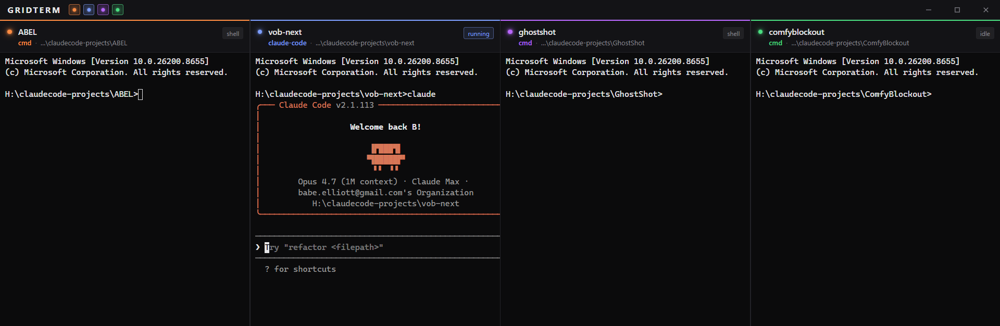

# gridterm

**gridterm is a lightweight terminal grid for Windows.** It puts up to 4 real shells side by side in one window, each with a labeled header showing project name, working directory, and a color-coded dot — so you always know which terminal is which.



## Why

Juggling 4 identical black `cmd` windows is a pain. They all say "Command Prompt" in the taskbar and it's easy to run the wrong command in the wrong project. gridterm gives every terminal an identity: a colored dot, a project name, and a live cwd. You always know where you are before you hit Enter.

## Features

- **1–4 columns** — toggle each one on/off from the top bar
- **Live cwd tracking** — the header updates automatically as you `cd`
- **Claude Code detection** — badge flips to `running` when `claude` is running in that shell
- **Drag to reorder** — grab any header, drop it on another column
- **Custom titlebar** with GRIDTERM branding + minimize / maximize / close

## Install (Windows)

1. Go to [Releases](https://github.com/spiritform/gridterm/releases)
2. Download `gridterm_0.1.0_x64-setup.exe`
3. Run the installer. Windows may show a SmartScreen warning about an unknown publisher — click **More info → Run anyway**
4. Launch gridterm from the Start menu

That's it. No configuration required.

## Build from source

### Prerequisites

- [Node.js](https://nodejs.org/) 20+
- [Rust](https://rustup.rs/)
- Platform SDK:
  - **Windows** — [Visual Studio C++ Build Tools](https://visualstudio.microsoft.com/visual-cpp-build-tools/) + [WebView2](https://developer.microsoft.com/en-us/microsoft-edge/webview2/) (usually preinstalled on Windows 11)
  - **macOS** — Xcode Command Line Tools (`xcode-select --install`)
  - **Linux** — see [Tauri prerequisites](https://tauri.app/start/prerequisites/#linux)

### Build

```bash
git clone https://github.com/spiritform/gridterm
cd gridterm
npm install
npm run tauri build
```

Installers land in `src-tauri/target/release/bundle/`:

- **Windows** — `nsis/gridterm_0.1.0_x64-setup.exe` (installer) or `msi/gridterm_0.1.0_x64_en-US.msi`
- **macOS** — `dmg/gridterm_0.1.0_x64.dmg` and `macos/gridterm.app`
- **Linux** — `deb/`, `appimage/`, or `rpm/`

### macOS notes

The Rust backend uses `portable-pty` which is cross-platform — the code should build for macOS without changes. Unsigned builds will trigger Gatekeeper on first launch: right-click the `.app` → **Open** → **Open anyway** to bypass. For real distribution you'll want an Apple Developer certificate to sign the bundle.

## Development

```bash
npm run tauri dev
```

Or double-click `dev.bat` (Windows). Hot reload for HTML/CSS/JS via Ctrl+R in the window; Rust changes trigger an automatic recompile.

## Stack

Tauri 2 · vanilla JS · xterm.js · portable-pty (Rust) · sysinfo
